# Documentation Plan: fountain-py

An adversarial, Diataxis-driven review of the fountain-py docs, with a prioritized plan to fix them.
Scope: `README.md`, everything under `docs/source/` (excluding `docs/build/`), checked against the real code in `src/fountain/`.

## Executive Summary

The docs read like a polished, published library.
The library is neither published nor as small-surfaced as the docs pretend, and the top of every funnel is broken.

The five highest-impact problems:

1. The first instruction every reader sees does not work.
   `pip install fountain-py` returns a 404 on PyPI (the package is unpublished, still `0.1.0`), yet `README.md`, `installation.rst`, and `quickstart.rst` all lead with it.
   A new user cannot get past line one.
2. Shipped code examples call a method that does not exist.
   `parsing.rst` and `rendering.rst` both call `document.get_character_names()`; the real method is `get_characters()`.
   These sit in `code-block` directives, so Sphinx doctest never runs them and never caught the drift.
3. A real, useful feature is invisible.
   `FountainParser.validate()`, `ValidationIssue`, and `FountainDocument.issues` exist and are docstring-documented, but no narrative page, feature list, or how-to mentions them.
4. Diataxis mixing everywhere.
   `quickstart.rst` (360 lines), `parsing.rst` (660 lines), and `rendering.rst` (468 lines) each blend tutorial, how-to, reference, and explanation into one scroll.
   There is no true explanation quadrant and no standalone how-to recipe a working user can land on.
5. The landing page is AI-marketing copy.
   `index.rst` opens with emoji feature cards, "battle-tested parsing engine", "Script Intelligence", "embraced by writers and filmmakers worldwide", banned vocabulary (`robust`, `comprehensive`), and em-dashes that violate the project owner's own writing rules.

Target end-state, in one paragraph:
A brand-new user lands on a plain, honest home page, follows one short tutorial that parses a real screenplay and opens a rendered HTML file in under five minutes, and then branches to a small set of goal-named how-to recipes (render to a file, embed a fragment, validate a file, extract one character's lines, round-trip to clean Fountain) and to austere autodoc reference.
Concepts (what Fountain is, how the parse-structure-render pipeline works, what the round-trip guarantees and the lossy inline-note contract mean) live in a couple of short explanation pages, not smuggled inside reference dumps.
Every runnable snippet actually runs, and drift-prone numbers stop being hand-copied into prose.

## Adversarial Findings

### Blockers and Accuracy (docs that lie)

- **`pip install fountain-py` fails.**
  Files: `README.md` (line 25), `docs/source/installation.rst` (lines 17, 27), `docs/source/quickstart.rst` (line 21), `docs/source/index.rst` install card.
  PyPI returns 404 for the package; `pyproject.toml` is still `version = "0.1.0"` and unpublished.
  Fix: until the package is published, lead every install path with a source install (`pip install git+https://github.com/MasonEgger/fountain-py.git` or clone plus `pip install -e .`) and state plainly that PyPI publication is pending.
  Once published, revert to `pip install fountain-py`.
  Also drop or gate the PyPI version and Python-versions badges in `README.md` and `index.rst` that currently point at a nonexistent release.

- **`get_character_names()` does not exist.**
  Files: `docs/source/user-guide/parsing.rst` (line 625), `docs/source/user-guide/rendering.rst` (line 426).
  The method is `FountainDocument.get_characters()`.
  These are in `.. code-block:: python`, not `.. doctest::`, so they are never executed and silently rot.
  Fix: rename to `get_characters()`, and where feasible convert illustrative snippets to `doctest` so the CI doctest run catches future drift.

- **Example files that do not ship.**
  Files: `docs/source/index.rst` (line 58, `parse_file("big_fish.fountain")`), `quickstart.rst`, `parsing.rst`, `rendering.rst` (all reference `my_screenplay.fountain` / `screenplay.fountain`).
  The only fixture is `tests/fixtures/simple_script.fountain`.
  A reader copy-pasting the file examples has no file to point at.
  Fix: ship one realistic sample screenplay in the docs (or reuse a fixture) and reference that exact filename everywhere `parse_file` appears.

- **Element-type count contradicts itself.**
  `parsing.rst` (line 159) says "one of 14 element types" and then lists 13 bullets; `elements.rst` (line 45) and the `ElementType` enum say 15.
  Fix: state 15 total types, note that `TITLE_PAGE` is not a body-line classification, and make the bullet list match.

### Diataxis Integrity (mixing and a missing quadrant)

- **`quickstart.rst` is three doc types wearing a tutorial's name.**
  It is labeled a "10 minute" tutorial but runs 360 lines and folds in how-to material (error handling, parsing from files, multiple output formats) and reference-style element iteration.
  A tutorial should carry a beginner along one guaranteed-to-work path and defer everything else.
  Fix: cut it to the golden path below; relocate the rest into named how-to guides.

- **`parsing.rst` is reference and explanation mislabeled as a user guide.**
  Edge-case behavior (line-one title-page detection, `FADE IN:` handling, inline-note asymmetry, lyrics inside dialogue) is reference; the two-pass rationale and "just write" philosophy is explanation; the dialogue-pairing walkthrough is how-to.
  All three are stacked in one 660-line page a novice is invited into from the quickstart.
  Fix: split into an explanation page (the pipeline and parsing philosophy), a reference page (edge-case behavior table and forced-element rules), and pull the dialogue-pairing example into a how-to.

- **`rendering.rst` mixes how-to, reference, and explanation.**
  The CSS-class table (lines 146-169) and the omitted-elements contract are reference; save-to-file and custom-renderer sections are how-to; the "rendering pipeline" section is explanation.
  Fix: keep a reference page for the CSS class table and render-mode contract, move the recipes to how-to, and fold the pipeline prose into the explanation page.

- **No explanation quadrant exists.**
  There is no conceptual page answering "what is Fountain", "how does fountain-py model a screenplay", "what does the round-trip actually guarantee", or "why are inline notes lossy but standalone notes kept".
  These facts are real (documented in `renderer.rst`, `parsing.rst`, and the `FountainElement` docstring) but scattered.
  Fix: create `explanation/` pages that own the concepts once, and have reference and how-to link to them.

- **No standalone how-to recipes.**
  Every goal-oriented task (render to a standalone file, embed a fragment in a page or static site, validate a file, extract one character's dialogue, export JSON, round-trip to clean Fountain) exists only as a buried snippet inside a longer page.
  A working user cannot land on "how do I render to HTML" as its own answer.
  Fix: create short, single-goal how-to pages named for the goal.

### Gaps (what a user needs and cannot find)

- **Validation API is undocumented in prose.**
  `FountainParser.validate()` returns `list[ValidationIssue]` with codes `unclosed-boneyard`, `unclosed-note`, `orphan-character-cue`, `empty-document`; `FountainDocument.issues` carries the same.
  Absent from `README.md` features, `index.rst`, and every user-guide page.
  Fix: add a how-to ("Validate a Fountain file and report problems") and list it as a feature.

- **Styling the HTML output is never shown end to end.**
  `rendering.rst` lists CSS classes and mentions `get_css()`, but there is no recipe that takes `get_css()`, overrides a class, and produces a restyled page.
  Fix: add a "Style the HTML output" how-to using `get_css()` plus a custom stylesheet.

- **JSON / dict export is under-surfaced.**
  `to_json()` and `to_dict()` appear once inside the quickstart but are not in the README feature list and have no recipe.
  Fix: add a short "Export a screenplay to JSON" how-to.

- **Embedding in a web app or static site is asserted, not shown.**
  `README.md` and `rendering.rst` claim the fragment is "ideal for mkdocs or static site generators" but show no actual integration.
  Fix: one concrete embed recipe (fragment plus `get_css()` into a page template).

### Overwhelm and Redundancy

- **`quickstart.rst` front-loads a full analysis tool and error-handling harness** (lines 228-349) onto someone who has not yet parsed anything.
  Cut to the golden path; these become how-to material or get dropped.

- **`elements.rst` duplicates the `ElementType` docstring and the `api/elements` autodoc.**
  The per-type catalog is worth keeping as reference, but it should not restate what autodoc already emits.
  Fix: make `elements.rst` a focused reference table and link to autodoc for the class-level detail.

- **Hardcoded metrics drift.**
  "314 tests", "99% coverage", "38 module-level doctests + 447 Sphinx doctests" are hand-copied into `README.md` (line 17), `index.rst` (badge), and `changelog.rst` (lines 69-70).
  Git history shows repeated "Bump documented test count" commits, which is the drift proving itself.
  Fix: drop exact counts from prose; keep coverage as a CI-generated badge only, and let the changelog state capabilities, not a test tally.

### Navigation and Information Architecture

- **Orphaned pages that are still linked.**
  `docs/source/user-guide/index.rst` and `docs/source/api/index.rst` are marked `:orphan:`, yet `quickstart.rst` "Next Steps" links `api/index` and `README.md` links `api/index.html`.
  The "User Guide" landing page is unreachable from the toctree.
  Fix: either include these landing pages in the toctree or stop linking to them; do not both orphan and link a page.

- **No clear happy path in the toctree.**
  `index.rst` groups pages by module ("User Guide", "API Reference") rather than by user intent, so a novice cannot see the tutorial-then-how-to-then-reference progression.
  Fix: reorganize the toctree by Diataxis type (Tutorial, How-to, Reference, Explanation).

### Voice and Style

- **Marketing puffery and emoji on the landing page.**
  `index.rst`: emoji feature cards, "battle-tested parsing engine", "Script Intelligence", "embraced by writers and filmmakers worldwide", "Transform your scripts ... with ease".
  `README.md`: "Full Fountain Spec Compliance", "Well-Tested".
  Fix: replace with plain statements of what the library does.

- **Banned vocabulary and em-dashes in the owner's own public docs.**
  `robust` and `comprehensive` appear in `index.rst` (lines 16, 41) and throughout the user guide; em-dashes appear in `README.md`, `index.rst`, `changelog.rst`, `contributing/development.rst`, and `contributing/testing.rst`.
  This violates the project owner's stated writing rules (no em-dashes, banned-word list).
  Fix: scrub em-dashes (replace with commas, colons, or periods) and remove the banned words during the rewrite.

- **"Professional" and superlatives in headings.**
  `index.rst` title is "Professional Fountain Script Parser".
  Fix: name what it is, not how good it is.

## Proposed Information Architecture

Reorganize by Diataxis type.
Bold nodes are new pages; nodes marked (split) or (merge) show where existing content moves.

```mermaid
graph TD
    Home["Home / index.rst<br/>(de-marketed landing + honest install status)"]

    Home --> T["Tutorials"]
    Home --> H["How-to Guides"]
    Home --> R["Reference"]
    Home --> E["Explanation"]
    Home --> C["Contributing (unchanged)"]

    T --> T1["quickstart.rst<br/>TRIMMED to one golden-path tutorial"]

    H --> H1["<b>render-to-html-file.md</b><br/>(from rendering.rst recipe)"]
    H --> H2["<b>embed-fragment.md</b><br/>(fragment + get_css into a page)"]
    H --> H3["<b>validate-a-file.md</b><br/>(NEW: validate() API)"]
    H --> H4["<b>extract-character-dialogue.md</b><br/>(from parsing.rst)"]
    H --> H5["<b>export-to-json.md</b><br/>(from quickstart)"]
    H --> H6["<b>roundtrip-clean-fountain.md</b><br/>(from rendering.rst)"]
    H --> H7["<b>style-the-html.md</b><br/>(NEW: get_css override)"]

    R --> R1["reference/elements.rst<br/>(elements.rst trimmed to a type table)"]
    R --> R2["reference/parsing-behavior.rst<br/>(edge cases split from parsing.rst)"]
    R --> R3["reference/css-classes.rst<br/>(class table split from rendering.rst)"]
    R --> R4["api/*.rst autodoc<br/>(unchanged; de-orphan api/index)"]

    E --> E1["<b>explanation/what-is-fountain.md</b>"]
    E --> E2["<b>explanation/pipeline.md</b><br/>(two-pass parse-structure-render)"]
    E --> E3["<b>explanation/roundtrip-and-notes.md</b><br/>(guarantees + lossy inline notes)"]

    C --> C1["contributing/* (as-is, em-dash scrub)"]
```



Fate of each existing page:

- `index.rst`: rewrite (de-market, honest install, intent-based toctree). Stays.
- `installation.rst`: fix install commands; trim Poetry/Pipenv duplication to a short table. Stays as reference-ish how-to.
- `quickstart.rst`: cut hard to the golden path. Stays as the one tutorial.
- `user-guide/parsing.rst`: split into `explanation/pipeline.md` and `reference/parsing-behavior.rst`; dialogue example to a how-to. Original dies.
- `user-guide/rendering.rst`: split into how-to recipes plus `reference/css-classes.rst`; pipeline prose to explanation. Original dies.
- `user-guide/elements.rst`: trim to a reference table under `reference/`. Slimmed.
- `user-guide/index.rst`: delete (orphaned landing, replaced by intent-based nav).
- `api/*.rst`: keep; de-orphan `api/index.rst` or stop linking it.
- `changelog.rst`: keep; drop hand-counted metrics, scrub em-dashes.
- `contributing/*`: keep; scrub em-dashes.

## Prioritized Backlog

### P0 (blocks a good first impression) — keep this set lean

- Fix the install story in `README.md`, `installation.rst`, `quickstart.rst`, `index.rst`: source install first, state PyPI is pending, because `pip install fountain-py` 404s today.
- Fix the two `get_character_names()` calls (`parsing.rst:625`, `rendering.rst:426`) to `get_characters()`, because they are broken and untested.
- Trim `quickstart.rst` to one runnable golden-path tutorial (parse a real screenplay, render, open the file), because the current 360-line mix is not a 5-minute onboarding.
- Rewrite `index.rst` landing copy: strip emoji, puffery, banned words, and em-dashes, because the first impression is AI marketing, not an honest tool description.

### P1 (fills real gaps)

- Add how-to "Validate a Fountain file" documenting `validate()` / `ValidationIssue` / `doc.issues`, because a real feature is invisible.
- Split `parsing.rst` into `explanation/pipeline.md` + `reference/parsing-behavior.rst`, because reference and explanation are tangled in a novice-facing page.
- Split `rendering.rst` into how-to recipes + `reference/css-classes.rst`, same reason.
- Add the explanation pages (`what-is-fountain`, `pipeline`, `roundtrip-and-notes`), because the understanding quadrant is missing.
- Ship one sample `.fountain` file and point every `parse_file` example at it, because referenced files do not exist.
- Reorganize the `index.rst` toctree by Diataxis type, because module-grouped nav hides the happy path.

### P2 (polish)

- Add how-to guides for embed-fragment, export-to-json, roundtrip-clean-fountain, style-the-html.
- Trim `elements.rst` to a reference table and stop duplicating autodoc.
- Remove hardcoded test/coverage/doctest counts from `README.md`, `index.rst`, `changelog.rst`; keep a CI coverage badge only.
- De-orphan or stop linking `api/index.rst` and delete `user-guide/index.rst`.
- Fix the 14-vs-15 element-type count in `parsing.rst`.
- Scrub em-dashes from `changelog.rst`, `contributing/development.rst`, `contributing/testing.rst`.
- Add validation and JSON export to the `README.md` feature list.

## The Golden Path

The exact minimal sequence a brand-new user should hit:

1. Home (`index.rst`): one honest sentence on what the library does, and the source-install command.
2. Install (`installation.rst`): source install, verify with `python -c "import fountain"`.
3. Tutorial (`quickstart.rst`): the single runnable example below, ending by opening the HTML file in a browser.
4. From the tutorial's footer, branch to how-to recipes and reference.

The single example that anchors the quickstart (nothing else in the tutorial):

```python
from fountain import FountainParser

script = """Title: The Coffee Shop Connection
Author: Jane Doe

INT. COFFEE SHOP - DAY

ALICE sits at a corner table, staring at her laptop.

ALICE
(muttering)
Come on, inspiration... where are you?

BOB
Excuse me, is this seat taken?

ALICE
No, go ahead.
"""

document = FountainParser().parse(script)

print(document.metadata["title"])   # The Coffee Shop Connection
print(document.get_characters())    # ['ALICE', 'BOB']

with open("coffee_shop.html", "w", encoding="utf-8") as f:
    f.write(document.to_html())
```

That is the whole tutorial: parse an inline screenplay, confirm two facts, write one self-contained HTML file, open it.
Everything currently in the quickstart after "Rendering to HTML" moves to how-to guides.

## Non-Goals (deliberately left out to avoid bloat)

- No exhaustive Fountain-syntax tutorial.
  Link out to `fountain.io/syntax`; this library's docs teach the API, not the format.
- No API-reference prose that restates autodoc.
  Keep `api/*.rst` as thin automodule stubs; do not hand-write method tables.
- No performance-tuning or benchmarking guide.
  The parser is a single-pass, small-input tool; the "Performance Considerations" section in `parsing.rst` is over-claiming for a library that parses plain text, and should shrink to one honest line, not grow.
- No custom-renderer framework docs beyond one example.
  One "write your own renderer" how-to is enough; do not document a plugin architecture that does not exist.
- No multi-page marketing or comparison content.
  No "why fountain-py vs other parsers" page.
- Do not expand the changelog into per-commit detail.
  Capability-level entries only.
